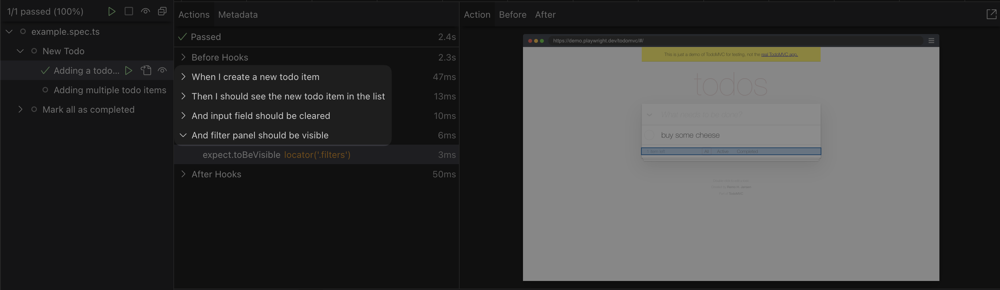

# `@jagoral/playwright-cucumber`

Cucumber syntax extensions for [`Playwright`](https://playwright.dev/).



## Installation

```bash
npm install @jagoral/playwright-cucumber
```

## Usage

```typescript
import { gherkinTest } from "@jagoral/playwright-cucumber";
import { expect, test } from "@playwright/test";

test.beforeEach(async ({ page }) => {
  await page.goto("https://demo.playwright.dev/todomvc");
});

const { Scenario, Feature } = gherkinTest(test);

Feature("New Todo", () => {
  Scenario("Adding a todo item", async ({ page, And, When, Then }) => {
    const input = page.getByPlaceholder("What needs to be done?");

    const { todoName } = await When("I create a new todo item", async () => {
      const todoName = "Buy Milk";
      await input.fill(todoName);
      await input.press("Enter");
      return {
        todoName
      }
    });

    await Then("I should see the new todo item in the list", async () => {
      await expect(page.getByTestId("todo-title")).toHaveText(todoName);
    });

    await And("the input field should be cleared", async () => {
      await expect(input).toBeEmpty();
    });

    await And("the filter panel should be visible", async () => {
      await expect(page.locator(".filters")).toBeVisible();
    });
  });
});
```

Check out the [example project](../../examples/playwright/) for more details.

## API

### `gherkinTest`

`gherkinTest` is a function that takes a `test` function from `@playwright/test`, and returns an object with `Feature` and `Scenario` functions.

| Parameter           | Type                | Description                                               |
| :------------------ | :------------------ | :-------------------------------------------------------- |
| `stepNameFormatter` | `StepNameFormatter` | **Optional**. Allows to customize the step name. Example: |
```ts
const { Scenario, Feature } = gherkinTest(test, {
  stepNameFormatter: ({ step, title }) => `${step} ${title}`,
});
```
|

`Scenario` has [the same API as Playwright](https://playwright.dev/docs/api/class-test) `test`, so you can use `Scenario.only`, `Scenario.skip` and any other modifiers available in Playwright `test`.