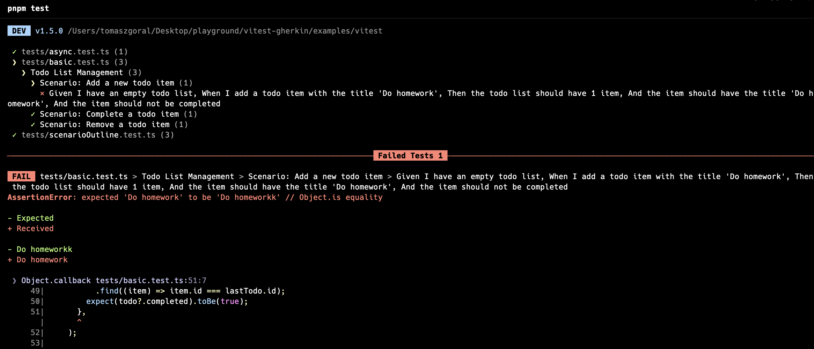

# `@jagoral/vitest-cucumber`

Cucumber syntax extensions for [`Vitest`](https://vitest.dev/), enabling you to write BDD-style tests with ease and efficiency.



## Installation

To get started, install the package via npm:

```bash
npm install @jagoral/vitest-cucumber
```

## Configuration

To use `@jagoral/vitest-cucumber`, you need to add the plugin to your `vite.config.ts` file. This configuration enables type-checking for your tests and integrates the plugin seamlessly into your Vitest setup.

### `vite.config.ts`

```typescript
import vitestCucumberPlugin from "@jagoral/vitest-cucumber/plugin";
import { defineConfig } from "vite";

export default defineConfig({
  test: {
    typecheck: {
      enabled: true,
    },
  },
  plugins: [vitestCucumberPlugin()],
});
```

## Usage

Here’s a sample test that demonstrates how to use `@jagoral/vitest-cucumber` for writing BDD-style tests with Vitest:

```typescript
import { feature, scenario } from "@jagoral/vitest-cucumber";
import { expect } from "vitest";
import { TodoList } from "../src/todo";

feature("Todo List Management", () => {
  scenario("Add a new todo item")
    .given("I have an empty todo list", () => {
      const todoList = new TodoList();
      return { todoList };
    })
    .when("I add a todo item with the title 'Do homework'", ({ todoList }) => {
      const todo = todoList.addTodo("Do homework");
      return { lastTodo: todo };
    })
    .then("the todo list should have 1 item", ({ todoList }) => {
      expect(todoList.getTodos().length).toBe(1);
    })
    .and("the item should have the title 'Do homework'", ({ todoList, lastTodo }) => {
      const todo = todoList.getTodos().find((item) => item.id === lastTodo.id);
      expect(todo?.title).toBe("Do homework");
    })
    .and("the item should not be completed", ({ todoList, lastTodo }) => {
      const todo = todoList.getTodos().find((item) => item.id === lastTodo.id);
      expect(todo?.completed).toBe(false);
    });

  scenario("Complete a todo item")
    .given("I have a todo list with a single item 'Do homework'", () => {
      const todoList = new TodoList();
      const todo = todoList.addTodo("Do homework");
      return { todoList, lastTodo: todo };
    })
    .when("I complete the todo item with id 1", ({ todoList }) => {
      todoList.completeTodo(1);
    })
    .then("the item should be marked as completed", ({ todoList, lastTodo }) => {
      const todo = todoList.getTodos().find((item) => item.id === lastTodo.id);
      expect(todo?.completed).toBe(true);
    });

  scenario("Remove a todo item")
    .given("I have a todo list with a single item 'Do homework'", () => {
      const todoList = new TodoList();
      const todo = todoList.addTodo("Do homework");
      return { todoList, lastTodo: todo };
    })
    .when("I remove the todo item with id 1", ({ todoList }) => {
      todoList.removeTodo(1);
    })
    .then("the todo list should be empty", ({ todoList }) => {
      expect(todoList.getTodos().length).toBe(0);
    });
});
```

Check out the [example project](../../examples/vitest/) for more details.

## API

### `scenario`

`scenario` is a function that allows you to define BDD-style scenarios using the `Given-When-Then` syntax directly in your test files. You can optionally pass Vitest modifiers (such as `{ skip: true }`) as the second argument.

| Parameter | Type          | Description                                                                                                                  |
| :-------- | :------------ | :--------------------------------------------------------------------------------------------------------------------------- |
| `title`   | `string`      | The title of the scenario.                                                                                                   |
| `options` | `TestOptions` | **Optional**. [Vitest options](https://vitest.dev/api/#test-api-reference) for scenario configuration like `skip` or `only`. |

```typescript
import { feature, scenario } from "@jagoral/vitest-cucumber";

feature("Todo List Management", () => {
  scenario("Add a new todo item", { skip: true })
    .given("I have an empty todo list", () => {
      const todoList = new TodoList();
      return { todoList };
    })
    .when("I add a todo item with the title 'Do homework'", ({ todoList }) => {
      const todo = todoList.addTodo("Do homework");
      return { lastTodo: todo };
    })
    .then("the todo list should have 1 item", ({ todoList }) => {
      expect(todoList.getTodos().length).toBe(1);
    })
    .and("the item should have the title 'Do homework'", ({ todoList, lastTodo }) => {
      const todo = todoList.getTodos().find((item) => item.id === lastTodo.id);
      expect(todo?.title).toBe("Do homework");
    })
    .and("the item should not be completed", ({ todoList }) => {
      const todo = todoList.getTodos().find((item) => item.id === lastTodo.id);
      expect(todo?.completed).toBe(false);
    });
});
```

### `scenarioOutline`

`scenarioOutline` is a function that lets you define parameterized scenarios with examples. It helps in testing multiple data sets with the same test logic.

| Parameter | Type          | Description                                                                                                                  |
| :-------- | :------------ | :--------------------------------------------------------------------------------------------------------------------------- |
| `title`   | `string`      | The title of the scenario outline.                                                                                           |
| `options` | `TestOptions` | **Optional**. [Vitest options](https://vitest.dev/api/#test-api-reference) for scenario configuration like `skip` or `only`. |

```typescript
import { feature, scenario } from "@jagoral/vitest-cucumber";

feature("Todo List Management", () => {
  scenarioOutline("Update todo item title")
    .given("I have a todo list with an item titled 'Initial Title'", () => {
      const todoList = new TodoList();
      const todo = todoList.addTodo("Initial Title");
      return { todoList, lastTodo: todo };
    })
    .when(
      "I update the todo item's title to '{{newTitle}}'",
      ({ lastTodo, todoList, variables }) => {
        todoList.updateTodoTitle(lastTodo.id, variables.newTitle);
      },
    )
    .then(
      "the todo item should have the title '{{newTitle}}'",
      ({ todoList, lastTodo, variables }) => {
        const todo = todoList
          .getTodos()
          .find((item) => item.id === lastTodo.id);
        expect(todo?.title).toBe(variables.newTitle);
      },
    )
    .examples([
      { newTitle: "Updated Title 1" },
      { newTitle: "Updated Title 2" },
      { newTitle: "Another New Title" },
    ]);
});